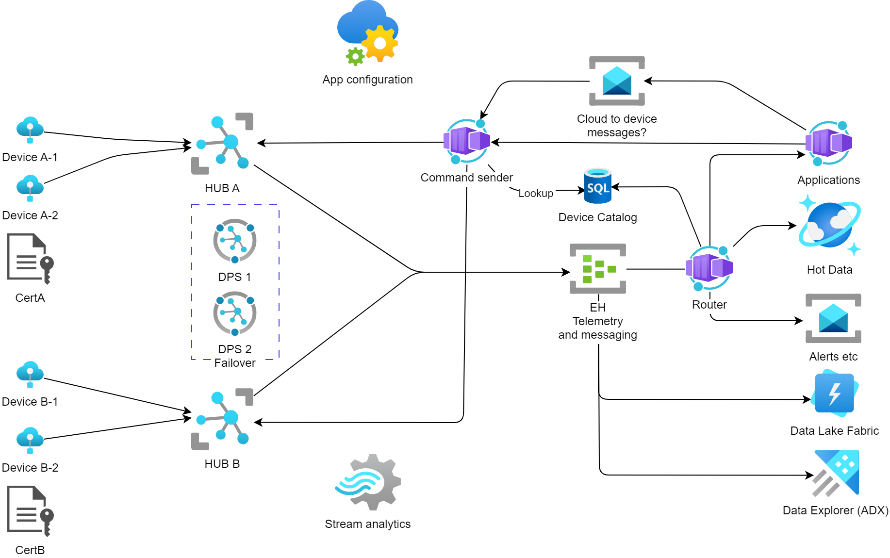

# iot-scale-demo
Demo repo for scaling azure iot scenarios 

**Disclaimer**: This is a demo repo and not intended for production use. 



## Generate test certificates using step

Use the following commands to generate test certificates using [step](https://smallstep.com/docs/step-cli/installation/). 

```pwsh
step ca init --deployment-type standalone --name huba --dns localhost --address 127.0.0.1:443 --provisioner HubAProvisoner --context huba
step ca init --deployment-type standalone --name hubb --dns localhost --address 127.0.0.1:443 --provisioner HubBProvisoner --context hubb
```

The copy and rename the intermediate certificate and key to the `certs` folder. 

```pwsh
copy $Env:USERPROFILE/.step/authorities/huba/certs/intermediate_ca.crt -d ./certs/huba_intermediate.pem
copy $Env:USERPROFILE/.step/authorities/hubb/certs/intermediate_ca.crt -d ./certs/hubb_intermediate.pem
```

The copy the and rename key file. 

```pwsh
copy $Env:USERPROFILE/.step/authorities/huba/secrets/intermediate_ca_key* -d ./certs/huba_intermediate.key
copy $Env:USERPROFILE/.step/authorities/hubb/secrets/intermediate_ca_key* -d ./certs/hubb_intermediate.key
```

Create password files for the simulated devices. 

```pwsh
$Env:password = "<your cert password>"
echo $Env:password > ./certs/huba.pass
echo $Env:password > ./certs/hubb.pass
```

## Deploy the IotHub infrastructure

Follow the instructions in the [Infrastructure ReadMe](./infrastructure/hub-scenario/README.md) to deploy the IoT ingestion infrastructure.

## Add the certificates to the IoT Hubs

Follow this link to add the certificates and enrollment groups to the IoT Hubs: [Add certificates to IoT Hubs](https://learn.microsoft.com/en-us/azure/iot-dps/tutorial-custom-hsm-enrollment-group-x509?tabs=windows&pivots=programming-language-csharp#verify-ownership-of-the-root-certificate)

To split the traffic between the two hubs, create 2 enrollment groups and assign the certificates to the respective hubs.

## Run locally 

This demo uses Dapr to abstract the state and pubsub. So you need to have [Dapr](https://dapr.io/) installed. 

The run the demo with Aspire.
    
    